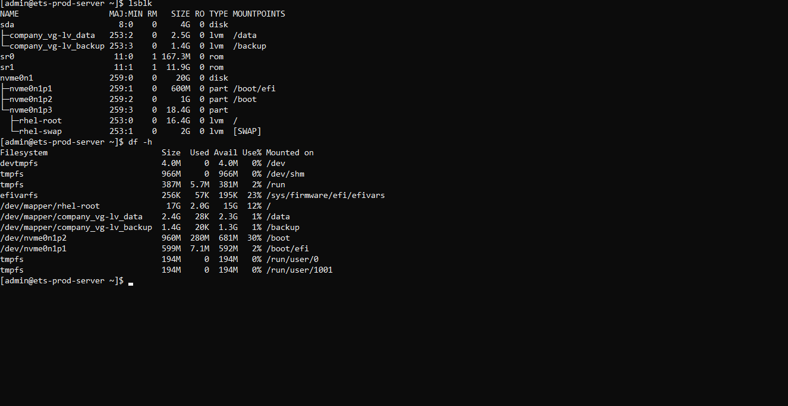
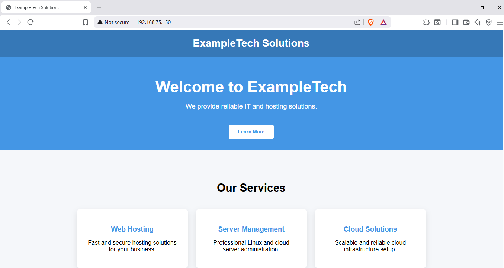
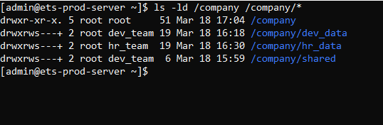
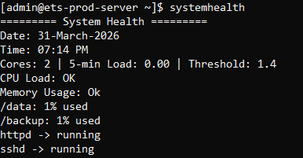

# rhel-enterprise-server
This project demonstrates the design and implementation of a production-style Linux server using Red Hat Enterprise Linux.  
The goal was to simulate a real-world enterprise environment including: 
-User management 
-Storage management (LVM) 
  
-Web server deployment 
  
-Security hardening 
  
-Automated backup 
-System monitoring 

